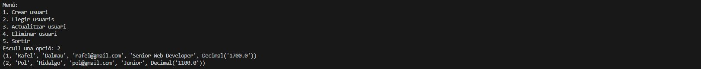

# CRUD amb Python by Rafel Dalmau

## Screenshots:

### Creem contenidor

### Conectem amb la bbdd

### Aquí creem la taula

### Creem un registre. En el nostre cas és una taula d'usuaris, per tant creem un usuari.

### Consultem la taula a veure si l'usuari s'ha creat correctament.

### Podem editar les dades de l'usuari fent ús de la funció update que hem creat.

### Eliminem un usuari i verificació de què s'ha eliminat.

## Dificultats a l'hora de crear la pràctica:
- Al crear contenidor he tingut varies complicacions, m'ha donat problema amb el tema de la versió de docker, em sortía que era obsolet.
